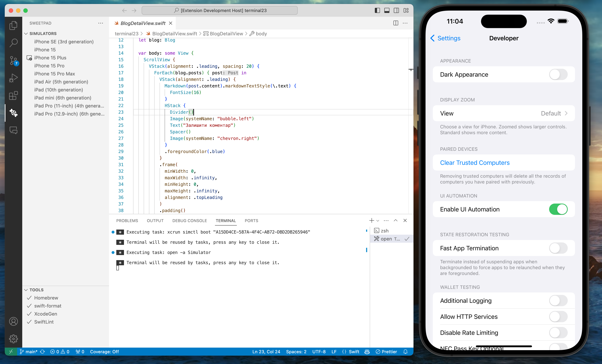

# SweetPad Organization

Develop Swift/iOS projects using VSCode.

The long-term goal is to make VSCode as a viable alternative to Xcode for iOS development, by integrating open-source tools such as swift-format, swiftlint, xcodebuild, xcrun, sourcekit-lsp, and so on into VSCode.

 - **[SweetPad for VSCode](https://github.com/sweetpad-dev/sweetpad)**
 - **[SweetPad Twitter](https://twitter.com/sweetpad_dev)**

